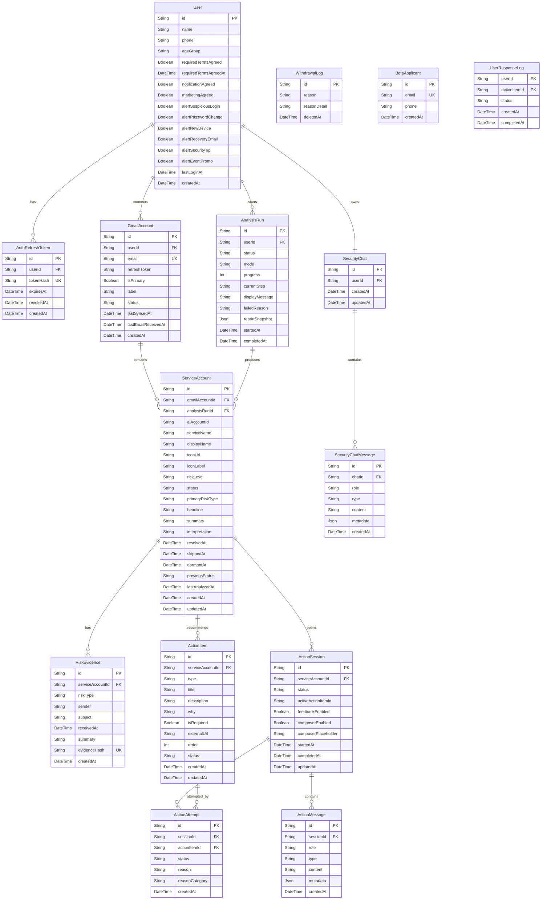

# IDly Backend ERD

이 문서는 `prisma/schema.prisma` 기준 전체 데이터 모델과 관계를 정리한 ERD 산출물입니다.

## ERD

## 테이블 설명

| 테이블 | 역할 |
| --- | --- |
| `User` | IDly 사용자 프로필, 약관 동의, 알림 설정을 저장합니다. |
| `AuthRefreshToken` | 앱 로그인 refresh token rotation/revoke를 위한 token hash를 저장합니다. Gmail OAuth refresh token과 별개입니다. |
| `WithdrawalLog` | 탈퇴 사유와 삭제 시점을 기록합니다. |
| `GmailAccount` | 사용자가 연결한 Gmail 계정과 OAuth refresh token을 저장합니다. |
| `AnalysisRun` | Gmail 분석 작업 단위와 진행 상태, 리포트 snapshot을 저장합니다. |
| `ServiceAccount` | Gmail 분석으로 발견된 서비스 계정 단위의 위험 상태를 저장합니다. |
| `RiskEvidence` | 서비스 계정 위험 판단 근거가 된 메일 메타데이터/요약을 저장합니다. 메일 원문은 저장하지 않습니다. |
| `ActionItem` | 서비스 계정별 추천 보안 조치 항목을 저장합니다. |
| `ActionSession` | 2-3 계정 상세 화면의 보안 조치 assistant 세션을 저장합니다. |
| `ActionMessage` | action assistant 대화 메시지와 rich message metadata를 저장합니다. |
| `ActionAttempt` | 사용자의 조치 완료/실패/사유 입력 기록을 저장합니다. |
| `SecurityChat` | 2-4 전체 보안 도우미 채팅 세션을 저장합니다. |
| `SecurityChatMessage` | 전체 보안 도우미의 사용자/assistant 메시지를 저장합니다. |
| `BetaApplicant` | 랜딩 페이지 베타 신청 정보를 저장합니다. |
| `UserResponseLog` | 외부 `IDly-apps-in-toss` 서비스에서 사용하는 응답 로그 테이블입니다. |

## 주요 제약 조건 및 인덱스

| 모델 | 제약/인덱스 |
| --- | --- |
| `AuthRefreshToken` | `tokenHash` unique, `[userId, expiresAt]` index |
| `GmailAccount` | `email` unique |
| `AnalysisRun` | `[userId, status]`, `[userId, startedAt]` index |
| `ServiceAccount` | `[gmailAccountId, serviceName]` unique, `[gmailAccountId, status]`, `[gmailAccountId, status, dormantAt]` index |
| `RiskEvidence` | `[serviceAccountId, evidenceHash]` unique |
| `ActionItem` | `[serviceAccountId, status]` index |
| `ActionSession` | `[serviceAccountId, status]` index, SQL migration에서 active session partial unique index 생성 |
| `ActionMessage` | `[sessionId, createdAt]` index |
| `SecurityChat` | `userId` unique |
| `SecurityChatMessage` | `[chatId, createdAt]` index |
| `BetaApplicant` | `email` unique |
| `UserResponseLog` | `[userId, actionItemId]` composite primary key, physical table name `user_response_logs` |

## 삭제 정책

| 관계 | 삭제 정책 |
| --- | --- |
| `User` -> `GmailAccount` | `onDelete: Cascade` |
| `User` -> `AnalysisRun` | `onDelete: Cascade` |
| `User` -> `AuthRefreshToken` | `onDelete: Cascade` |
| `User` -> `SecurityChat` | `onDelete: Cascade` |
| `GmailAccount` -> `ServiceAccount` | `onDelete: Cascade` |
| `ServiceAccount` -> `RiskEvidence` | `onDelete: Cascade` |
| `ServiceAccount` -> `ActionItem` | `onDelete: Cascade` |
| `ServiceAccount` -> `ActionSession` | `onDelete: Cascade` |
| `ActionSession` -> `ActionMessage` | `onDelete: Cascade` |
| `ActionSession` -> `ActionAttempt` | `onDelete: Cascade` |
| `ActionItem` -> `ActionAttempt` | `onDelete: Cascade` |
| `SecurityChat` -> `SecurityChatMessage` | `onDelete: Cascade` |
